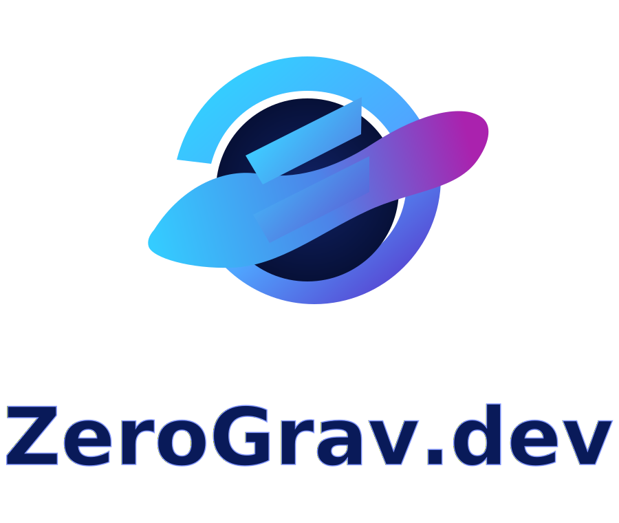

# ZeroGrav Prompt Vault

A single-page prompt vault featuring 100 detailed, execution-grade prompts for planning, design, UX, debugging, refactoring, performance, accessibility, content, marketing, and deployment.


**ZeroGrav.net**

## Why this exists
- **High-signal prompting**: Every prompt is structured to produce tactical, implementation-ready responses instead of generic advice.
- **Fast exploration**: Search, category filters, modal detail view, and per-card share controls keep discovery efficient.

## Key features
- **100 engineered prompts** across 10 categories.
- **Copy + share workflows** for each prompt and for the full vault.
- **Responsive visual design** with a branded header logo and SVG favicon.
- **Responsive visual design** with branded typography in the header and a PNG favicon set.
- **Veteran support CTA** at the bottom of the page pointing US Military Veterans to VeteranClaimBuilder.com for AI-powered VA Disability Compensation Claim Preparation.

## Project structure
```
.
├── index.html      # Page structure, SEO metadata, modal shell
├── styles.css      # Visual system, layout, card + button styling
├── script.js       # Prompt dataset, filtering, modal, copy/share behavior
└── assets/
    ├── zerograv-logo.svg  # Primary brand logo used in app + README + favicon
    ├── favicon-32.png     # Browser favicon (32x32)
    ├── favicon-16.png     # Browser favicon (16x16)
    ├── apple-touch-icon.png # iOS home-screen icon (180x180)
    └── zerograv-mark.svg  # Brand mark asset
```

## Local development
```bash
python -m http.server 4173
```
Then open `http://127.0.0.1:4173/`.

## Windows patch-apply workflow
Use the following PowerShell commands to clone, apply a patch, and push:

```powershell
cd $HOME\Documents\
git clone https://github.com/01001101010010010100101101000101/ZeroGrav.dev.git
cd .\ZeroGrav.dev\
git checkout -b work
git am C:\path\to\work.patch
git push -u origin work
```