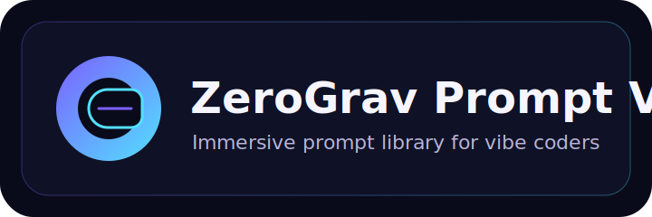

# ZeroGrav Prompt Vault

A single-page prompt vault that hosts 100 beginner-friendly prompts for vibe coders. It is designed for fast scanning, quick copying, and a clear funnel to VeteranClaimBuilder.com.



## Why this exists
- **SEO + GEO ready**: Metadata, JSON-LD, and clear headings help search engines and generative engines understand the page.
- **Beginner-first copy**: Every prompt is written for a 16-year-old to understand at a glance.
- **Fast exploration**: Search, category filters, and a modal that shows the full prompt with one click.

## Key features
- **100 prompts** across 10 categories (Planning, UI Design, UX Flow, Debugging, Refactoring, Performance, Accessibility, Content, Marketing, Deployment).
- **Instant copy** buttons for single prompts or the full list.
- **GEO funnel** with direct CTAs to VeteranClaimBuilder.com.
- **Modern UI** with subtle motion, floating orbs, and hover micro-interactions.

## Project structure
```
.
├── index.html      # Page structure, SEO meta tags, JSON-LD
├── styles.css      # Visual system, layout, and animations
├── script.js       # Prompt library + filtering, modal, copy logic
└── assets/
    └── logo.svg    # README logo graphic
```

## Local development
```bash
python -m http.server 4173
```
Then open `http://127.0.0.1:4173/`.

## Funnel destination
The primary conversion target for this experience is:
- https://VeteranClaimBuilder.com

## Notes
If you want additional prompt categories, new UI themes, or a multi-page version, share the requirements and I can extend the vault.
